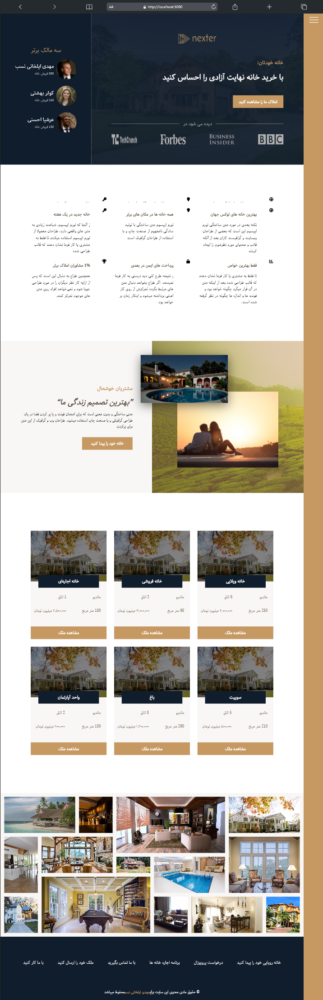
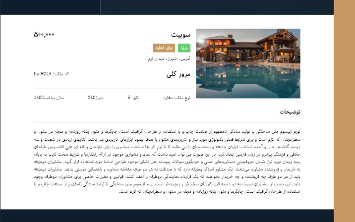

This is a [Next.js](https://nextjs.org/) project bootstrapped with [`create-next-app`](https://github.com/vercel/next.js/tree/canary/packages/create-next-app).

<h1>Real estate website</h1>

<h2>Total preview of home page</h2>

<h2>Sidebar animation acion</h2>

<h2>Responsive on mobile</h2>

<h2>Single home details</h2>

<h2>All houses page</h2>

Users can search for the house they want

.gif)

Users can sort houses by size, number of rooms, and price

Dynamic pagination of all houses

